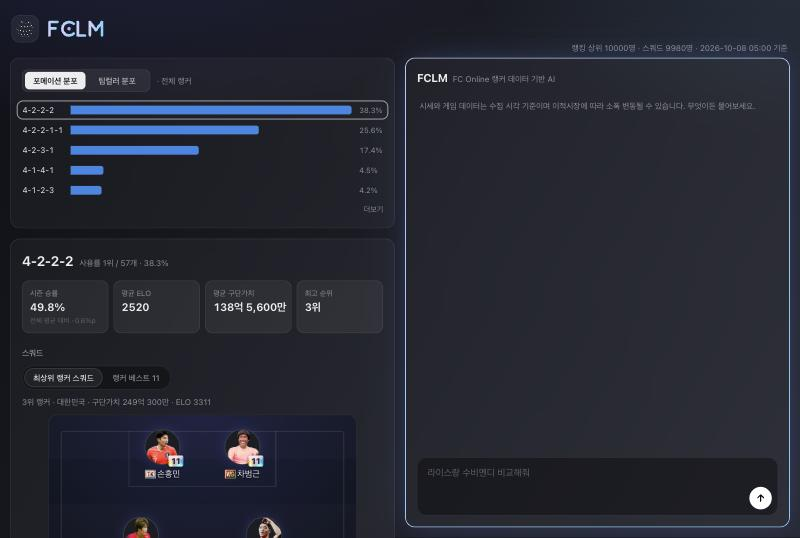
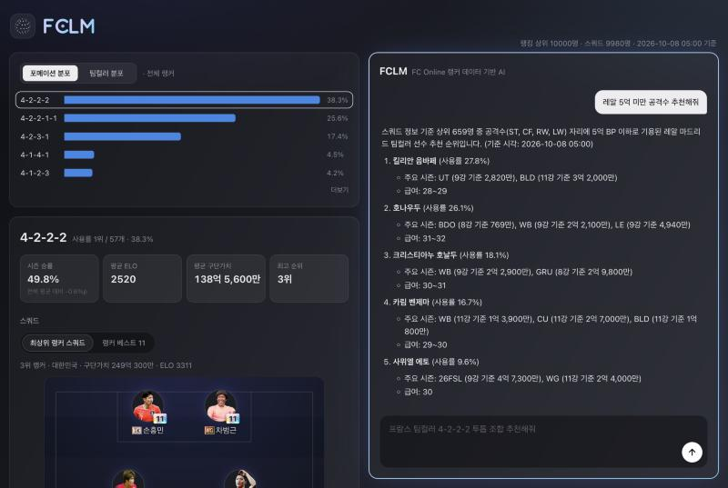
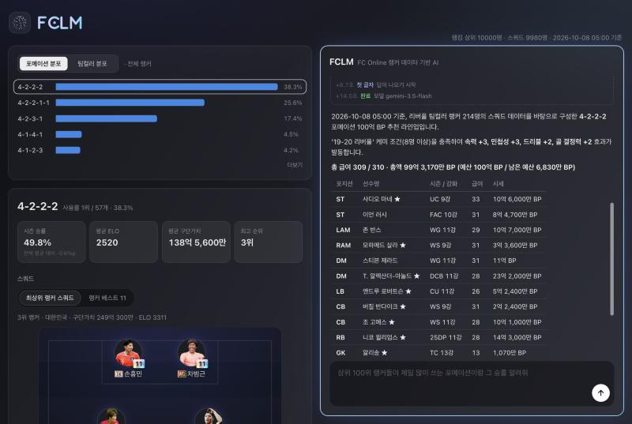
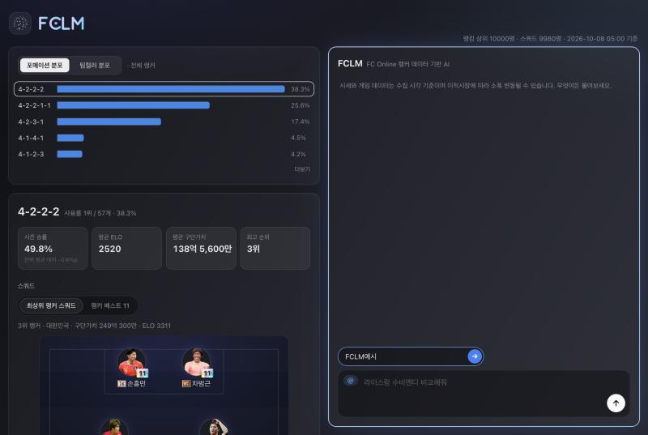
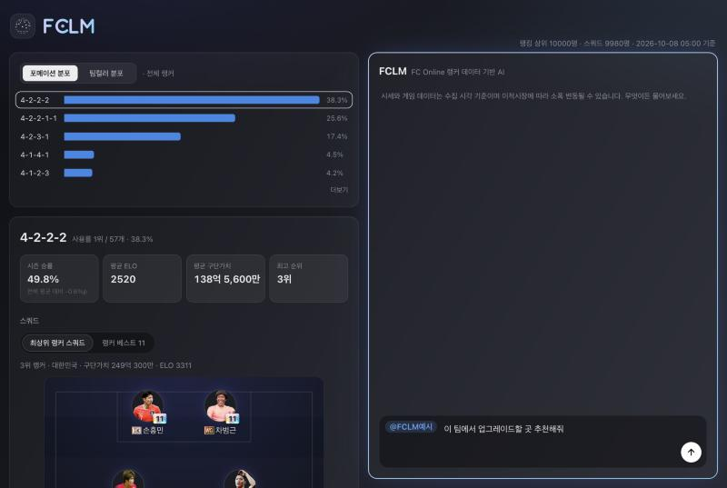
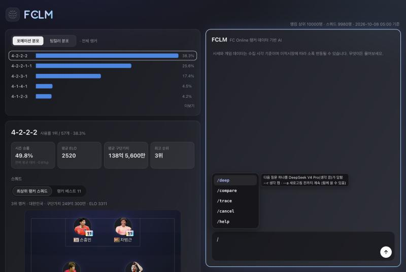
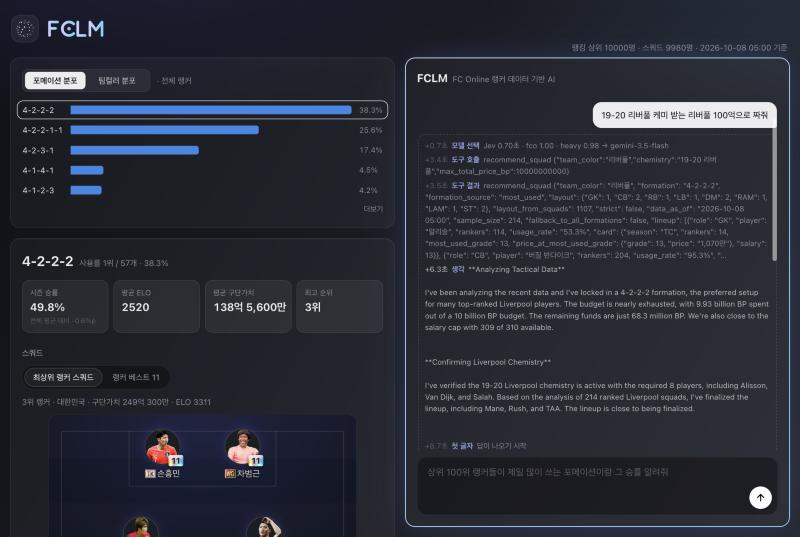

# FCLM

FC온라인 랭커 데이터로 선수 추천과 스쿼드 구성을 도와주는 AI 챗봇입니다.
랭킹 상위 랭커들이 실제로 쓰는 선수·카드·포메이션을 매일 모아, 질문에 데이터로 답합니다.

**사이트: <https://fclm.onrender.com>**

> 개발·운영 문서(설치, 수집, 배포, 평가)는 [`docs/DEVELOPMENT.md`](docs/DEVELOPMENT.md)에 있습니다.

## 화면 구성

- **왼쪽 위 — 분포**: 랭커들이 많이 쓰는 포메이션(또는 팀컬러)의 비율입니다. 줄을 누르면 아래에 그 포메이션의 상세가 나옵니다.
- **왼쪽 아래 — 포메이션 상세**: 사용 순위, 시즌 승률, 평균 ELO·구단가치, 최고 순위, 그리고 그 포메이션을 쓰는 최상위 랭커의 스쿼드와 랭커 베스트 11입니다.
- **오른쪽 — 챗봇**: 무엇이든 물어보는 곳입니다. 입력창의 회색 글씨는 질문 예시입니다.
- 맨 위 오른쪽에 지금 데이터가 몇 명의 랭커 기준이고 언제 모은 것인지 나옵니다.

## 질문하기

입력창에 질문을 쓰고 Enter(줄바꿈은 Shift+Enter)를 누르면 됩니다. 답을 기다리는 동안 보내기 버튼(↑)은 정지 버튼(■)이 됩니다.

이런 질문을 할 수 있습니다.

| 종류 | 예시 |
|---|---|
| 선수 추천 | 레알 5억 미만 공격수 추천해줘 · 10억 내로 아스널 볼란치 추천해줘 · 첼시 풀백 가성비 좋은 애 |
| 신규특성 | 라브달린 뮌헨 윙어 추천해줘 · 내가 수비수에 체 파를 달고 싶은데 달 수 있는 리버풀 수비수 추천해줄래? |
| 스쿼드 | 4-1-4-1 롬바르디아 짜줘 · 현역 레알마드리드 100억으로 짜줘 · 즐라탄을 포함한 바르샤 스쿼드 20억 미만으로 짜줘 |
| 비교·대체 | 라이스랑 수비멘디 비교해줘 · 리버풀을 하고있는데 UC마네 대신 급여를 1 줄일 수 있는 윙어가 있을까? |
| 메타·순위 | 요즘 사용률이 가장 많이 오른 팀컬러는? · 상위 100위 랭커들이 제일 많이 쓰는 포메이션이랑 그 승률 알려줘 |

- 팀컬러는 별칭으로 써도 됩니다 (레알, 바르샤, 뮌헨, 맨유, 롬바르디아 등).
- 신규특성 줄임말을 알아듣습니다 (라브 = 라인 브레이커, 트릭 = 트릭스터, 체 = 체이서, 파 = 파이터, 크포 = 크로스 포쳐 등).
  "달린"은 원래 가진 카드, "달 수 있는"은 8강(금카) 이상에서 하나를 새로 다는 카드까지입니다.
- 이어서 물어봐도 앞 대화를 기억합니다 ("그럼 더 싼 걸로").

## 스쿼드 짜기

- 라인업 표 바로 위에 **총 급여와 총액**이 굵게 나옵니다. 예산을 말했으면 남은 금액도 함께 나옵니다.
- 케미(관계 팀컬러)를 넣으면 케미가 적용되는 선수 옆에 **★**가 붙고, 표 아래에 몇 명인지 나옵니다.
- 원하는 조건을 말로 쓰면 그대로 반영합니다.
  - 예산·급여: "150억으로", "급여 300에 맞춰줘", "급여 315로"(게임 상한 310을 넘으면 넘는다고 알려 줍니다)
  - 남는 예산: 예산을 다 쓰지 않았으면 많이 쓰이는 자리부터 강화·시즌을 올려 씁니다
  - 선수: "슈케르를 포함해서", "벨링엄은 빼줘", "손흥민은 이미 TK 10강 있어"(가진 카드는 총액에서 뺍니다)
  - 방향: "골키퍼는 최대한 싸게", "남는 돈은 공격진에", "ST는 키 큰 선수로", "8강 이상 카드로만"
  - 신규특성: "전방 4명에 라브 트릭을 달 수 있는"

## @닉네임 — 내 팀을 붙여서 묻기

빈 입력창에 `@`를 치면 위에 작은 닉네임 칸이 뜹니다. 닉네임을 넣고 → 버튼(또는 Enter)을 누르면, 그 유저의 **최근 공식·친선경기 선발 11명**을 불러옵니다. 칸 밖을 누르면 취소됩니다.

불러오면 입력창 앞에 파란 `@닉네임`이 붙습니다. 그대로 질문을 이어 쓰면 그 팀(선수·시즌·강화·급여·시세·팀컬러)이 질문과 함께 전달됩니다.

- 멘션처럼 **그 질문 한 번**에 붙습니다. 보낸 뒤에는 입력창에서 사라지지만, 이어지는 질문도 그 팀을 기억합니다.
- 마우스를 올리면 나오는 ✕, 또는 빈 입력창에서 지우기 키로 뗄 수 있습니다.
- "이 팀에서 업그레이드할 곳 추천해줘", "내 팀에서 급여 줄이려면?"처럼 물으면 그 팀의 팀컬러 안에서 찾아 줍니다.
- 다른 사람 닉네임도 됩니다. 넥슨이 공개하는 경기 기록에서 가져오므로, 최근 공식·친선경기가 없으면 불러올 수 없습니다.
  보유 선수 전체가 아니라 최근 경기에 낸 선발 11명입니다.

## 명령어

입력창에 `/`를 치면 쓸 수 있는 명령어가 펼쳐집니다. 마우스를 올리거나 ↑↓로 고르면 설명이 나오고, 고르면(Enter·클릭·Tab) 입력창에 채워집니다. 한 번 더 Enter를 누르면 실행됩니다.

| 명령어 | 하는 일 |
|---|---|
| `/deep` | 다음 질문 하나를 DeepSeek V4 Pro(생각 끔)가 답합니다. 최대 5분 |
| `/deep --r` | 같은데 생각을 켭니다 (더 깊게, 더 느리게) |
| `/deep --a` | 다음 질문만이 아니라 새로고침하기 전까지 계속 (`--r`과 함께 쓸 수 있음) |
| `/compare` | 다음 질문을 세 AI 모델이 이름을 가린 채 동시에 답하고, 마음에 드는 답을 골라 대화를 이어 갑니다 (1시간에 2번) |
| `/trace` | 모델이 고른 경로·생각·도구 호출과 결과를 답 위에 보여 줍니다 |
| `/cancel` | 켜 둔 명령어를 모두 끄고 기본 상태로 돌아갑니다 |
| `/help` | 명령어와 @닉네임 사용법 |

모르는 명령어는 *invalid command.* 로 답합니다. 명령어는 새로고침하면 모두 꺼집니다.

### /trace — AI가 어떻게 답을 만들었는지 보기

질문마다 어떤 모델이 왜 골라졌는지, 어떤 도구를 어떤 조건으로 불렀는지, 도구가 무엇을 돌려줬는지, 각 단계가 몇 초째였는지가 답 위에 나옵니다.

## 어떻게 답하나요

- 질문은 먼저 가벼운 분류 모델이 나눕니다. FC온라인과 무관한 질문이나 지시를 바꾸려는 입력은 모델을 부르지 않고 정해진 문구로 거절합니다.
- 일반 질문은 Gemini 3.5 Flash-Lite, 스쿼드·복잡한 질문은 Gemini 3.5 Flash가 답합니다. 3.5 Flash가 한도에 걸리면 DeepSeek V4 Pro가 대신 답합니다.
- 모델은 수치를 직접 지어내지 않고 랭커 데이터를 조회하는 도구의 결과로만 답합니다. 도구 결과에 없는 숫자를 쓰면 한 번 다시 쓰게 합니다.

## 데이터 기준과 한계

- **랭킹**: 공식경기(1vs1) 랭킹 상위 10,000명의 순위·팀컬러·포메이션·ELO·시즌 전적·구단가치
- **스쿼드**: 그 랭커들이 랭킹 시각 직전 공식경기에 낸 선발 명단, 그 카드의 시세·급여·능력치
- 매일 오전 0시 30분(한국 시간)쯤 새로 모읍니다. 맨 위 오른쪽의 기준 시각을 확인하세요.
- 시세는 모은 시각 기준이라 이적시장에 따라 조금 다를 수 있습니다. 능력치는 1강 기준입니다.
- 랭커들이 쓰지 않은 카드는 시세·능력치가 없을 수 있습니다.
- 질문 수는 한 사람당 1분에 6개, 하루 60개까지입니다.
