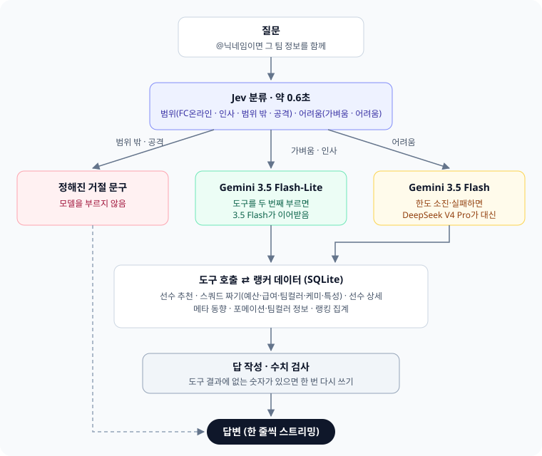

# FCLM

FC온라인 랭커 데이터로 선수 추천과 스쿼드 구성을 돕는 AI 챗봇입니다. 랭킹 상위 랭커들이 실제로 쓰는 선수·카드·포메이션을 매일 모아 데이터로 답합니다.

**사이트: <https://fclm.onrender.com>** · 개발·운영 문서: [`docs/DEVELOPMENT.md`](docs/DEVELOPMENT.md)

## 화면

- **왼쪽**: 랭커들의 포메이션·팀컬러 분포. 줄을 누르면 승률·ELO·구단가치와 최상위 랭커 스쿼드, 랭커 베스트 11이 나옵니다.
- **오른쪽**: 챗봇.

## 질문하기

질문을 쓰고 Enter 또는 보내기 버튼을 누르면 모델이 질문에 답합니다.

| 종류 | 예시 |
|---|---|
| 선수 추천 | 레알 5억 미만 공격수 추천해줘 · 첼시 풀백 가성비 좋은 애 |
| 신규특성 | 라브달린 뮌헨 윙어 추천해줘 · 체 파를 달 수 있는 리버풀 수비수 |
| 스쿼드 | 현역 레알마드리드 100억으로 짜줘 · 즐라탄을 포함한 바르샤 스쿼드 20억 미만 |
| 비교·대체 | 라이스랑 수비멘디 비교해줘 · UC마네 대신 급여를 1 줄일 수 있는 윙어 |
| 메타 | 요즘 사용률이 가장 많이 오른 팀컬러는? |

## @닉네임 — 내 팀으로 묻기

빈 입력창에 `@` → 닉네임 입력 → →(또는 Enter). 그 유저의 **최근 공식·친선경기 선발 11명**을 불러옵니다. 칸 밖을 누르면 취소.

입력창 앞에 붙은 `@닉네임` 뒤로 질문을 이어 쓰면, 그 팀(선수·강화·급여·시세·팀컬러)이 질문과 함께 전달됩니다.

- 이어지는 질문도 해당 팀을 기억합니다.
- 최근 공식·친선경기가 없으면 불러올 수 없고, 최근 경기 선발출전한 인원을 기준으로 합니다.

## 명령어

`/`를 치면 목록이 뜹니다. 마우스를 올리거나 ↑↓로 고르면 설명, 고르면 입력창에 채워지고 Enter로 실행합니다.

| 명령어 | 하는 일 |
|---|---|
| `/deep` | 다음 질문을 DeepSeek V4 Pro가 답함. `--r` 생각 켬, `--a` 새로고침 전까지 계속 |
| `/compare` | 다음 질문을 세 모델이 이름을 가린 채 답하고, 고른 답으로 대화를 이어 감 (1시간 2번) |
| `/trace` | 모델 선택·생각·도구 호출과 결과를 답 위에 표시 |
| `/cancel` | 켜 둔 명령어를 모두 끔 |
| `/help` | 사용법 |

## 답이 만들어지는 과정

- **Jev**(가벼운 분류 모델)가 먼저 질문을 나눕니다. 범위 밖이거나 지시를 바꾸려는 입력은 모델 없이 거절합니다.
- 모델은 숫자를 지어내지 않고 랭커 DB를 조회하는 **도구 결과로만** 답합니다. 결과에 없는 숫자가 있으면 한 번 다시 씁니다.

## 데이터 기준

- 공식경기(1vs1) 랭킹 상위 10,000명의 순위·팀컬러·포메이션·전적, 그 랭커들이 직전 공식경기에 낸 선발 명단, 카드 시세·급여·능력치(1강 기준).
- 매일 0시 30분(한국 시간)쯤 갱신. 시세는 수집 시각 기준이라 실제와 조금 다를 수 있습니다.

## Tech Stack

| Area | Stack |
|---|---|
| Backend | Python 3.12, FastAPI + Uvicorn (NDJSON streaming) |
| Data | SQLite, stored in a private Hugging Face dataset |
| Collection | NEXON Open API, FC Online Data Center scraping (httpx + selectolax) |
| AI | Gemini 3.5 Flash-Lite / Flash (google-genai), DeepSeek V4 Pro (OpenRouter), DB queries via tool calling |
| Question routing | Jev (OpenRouter Decisions API) |
| Frontend | Vanilla HTML / CSS / JS, marked + DOMPurify, border-beam, thinking-orbs |
| Automation / Deploy | GitHub Actions (daily collection), Render |
| Testing | pytest, eval script comparing models on question sets |
